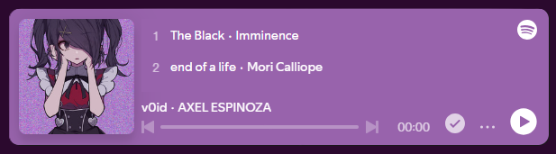

<body>
  

<h1 align="center">𓍢ִ໋🌷͙֒✧˚𝚆𝚎𝚕𝚌𝚘𝚖𝚎, 𝚖𝚊𝚔𝚎 𝚢𝚘𝚞𝚛𝚜𝚎𝚕𝚏 𝚌𝚘𝚖𝚏𝚘𝚛𝚝𝚊𝚋𝚕𝚎... ༘ ⋆｡˚♡🌼</h1>
  
𝐎𝐧𝐜𝐞 𝐲𝐨𝐮'𝐯𝐞 𝐰𝐞𝐚𝐭𝐡𝐞𝐫𝐞𝐝 𝐚 𝐬𝐭𝐨𝐫𝐦... 𝐲𝐨𝐮 𝐛𝐞𝐜𝐨𝐦𝐞 𝐭𝐡𝐞 𝐬𝐭𝐨𝐫𝐦.

  

      
  

   
<h2 align="center">~ 𝙰𝚋𝚘𝚞𝚝 𝚖𝚎 ~</h2>

        

    <b>💜 𝘊𝘶𝘳𝘳𝘦𝘯𝘵𝘭𝘺 𝘭𝘦𝘢𝘳𝘯𝘪𝘯𝘨 𝘵𝘰 𝘣𝘦 𝘍𝘶𝘭𝘭 𝘚𝘵𝘢𝘤𝘬 💜</b> 
    <b><a href="https://github.com/InozaAki">Axel Espinosa</a> (⸝⸝ᵕᴗᵕ⸝⸝)</b> 
    <b>Hobbies:</b> Manga 📕 | Photography 📷 | Chill ☕ | Coding 💻
  
I am a very passionate person about my work, always looking to give my best and to be updated. I'm also learning about algorithms and data structures.
  
   

 
<h2 align="center">𝙺𝚗𝚘𝚠𝚕𝚎𝚍𝚐𝚎🖥️</h2>

  
  
  
  
  

 
<h2 align="center">Contact me 📧</h2>

  

    
    
  

  

    
  

 

</body>
